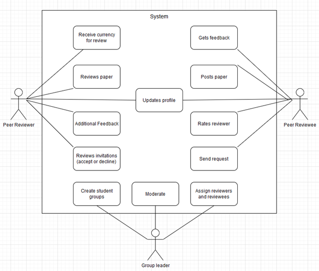

## CS 386 Deliverable 2 - Requirements
By: Ian Ambos, Chase Spigarelli, Nick Nannen, Brandon Roberts, Jonathan Velasco, Peter Galvan

## 1. Positioning

**1.1. Problem statement**
  - The problem of stress and workload effects on students needing their papers peer reviewed; The impact being unverified papers and documents that may have errors.

**1.2. Product Position Statement**
  - For academics and writers who need to get feedback on their papers, Peer Pad will help them by matching them up with peers of a similar academic level. Our site is unlike any other crowdsourcing site.

**1.3. Value proposition and consumer segment**
  - Value proposition: This new and improved technology will revolutionize the world with its peer editing capabilities and close community.
  - Consumer Segment: High school students, college students, writers, instructors

## 2. Stakeholders
- Users: Students, writers. They will be the people using and reviewing others papers 
	
- Developers: Ian Ambos, Chase Spigarelli, Nick Nannen, Brandon Roberts, Jonathan Velasco, Peter Galvan. Members of the group that test and build the code.

- Competitors: Wattpad, GitHub, Reddit, Chegg, Yahoo Answers, Google Docs, Paper. These are large competitors that don’t have peer editing software however you can share with friends or with other people that may give feedback.

## 3. Functional requirements (features)
- Users can post papers

- Users can review papers

- Users can update profiles

- Users can rate reviewers

- Users can get matched up with other Users for quick feedback  

## 4. Non-functional requirements
- Light on the eyes for easy access

- Simple and easy to use with little to no learning curve - at least 8 out of 10 testers need very little/no assistance in navigation

- Response time: <5ms

- Site readability is satisfactory for at least 8 out of 10 testers

- Site aesthetics are satisfactory for at least 8 out of 10 testers

## 5. MVP

- Minimum Viable Product

- Smallest feature that gets you the most learning, feedback, or failure.

- Comment feedback system

## 6. Use cases

**6.1. Use case diagram**

* 

**6.2. Use case descriptions and interface sketch**

* **Use case 1 By: Ian Ambos:**
  * Use Case: Reviewing paper
  * Actor: Reviewer
  * Description: A reviewer goes in and reviews a paper 
  * Preconditions: Paper submitted by a user 
  * Post-conditions: Paper is commented on 
  * Main Flow:
    * Reviewer goes to paper they want to review
    * Reviewer fills out review template provided by reviewee
    * Reviewer submits paper back to reviewee 
    * Reviewer receives token 
  * Alternative Flows:
    * Reviewer can’t finish the review
    * Reviewer saves current state of template and comes back later
    * OR
    * Reviewer forfeits token and cancels review
    * Reviewer is in matchmade review
    * Follow main flow
    * Instead of receiving token, reviewer has their paper reviewed 

* **Use case 2 By: Chase Spigarelli:**
  * Use Case: Rate Reviewer
  * Actor: Reviewee
  * Description: Reviewee rates the reviewer based on how well the feedback was.
  * Preconditions: Submitted paper, reviewed paper
  * Post-conditions: Reviewer is rated 
  * Main Flow:
    * Sign up
    * Write paper
    * Submit paper
    * Get Feedback on paper
    * Rate the feedback
  * Alternative Flows:
    * Sign up
    * Write paper
    * Submit paper
    * No feedback
    * Review someone else’s paper
    * Get feedback on paper
    * Rate the feedback

* **Use case 3 By: Brandon Roberts:**
  * Use Case: Paper review
  * Actor: Reviewer / Reviewee
  * Description: Process of reviewing and getting feedback
  * Preconditions: Paper made, submitting
  * Post-conditions: Paper reviewed, reviewer graded
  * Main Flow:
    * Reviewee posts review request
    * Reviewer receives request and accepts
    * Revierer reviews and sends back
    * Reviewee receives paper
    * Points and review distributed
  * Alternative Flows:
    * Reviewee posts review request
    * Reviewer receives request and denies
    * Paper gets forwarded to next reviewer
    * Reviewer reviews request and accepts
    * Revierer reviews and sends back
    * Reviewee receives paper
    * Points and review distributed

* **Use case 4 By: Jonathan White Velasco:**
  * Use Case: Sign up
  * Actor: User
  * Description: Sign up on Peer Pad
  * Preconditions: Have a internet access
  * Post-conditions: Signed up for Peerpad
  * Main Flow:
    * Go to URL address
    * Click “sign up”
    * Sign up
    * Choose username
    * Choose password
    * Log in
    * Enter username
    * Enter password
    * Now have access to full website (free trial)
  * Alternative Flows:
    * Go to URL address
    * Click “sign up”
    * Choose username
    * Choose password
    * Choose better password
    * Password already taken
    * Password is in a database of other passwords
    * Log in
    * Enter Username
    * Enter Password
    * Now have access to full website (free trial)

* **Use case 5 By: Nick Nannen:**
  * Use Case: Sends Request
  * Actor: Reviewee
  * Description: Sends a request to a specific reviewer to review a paper. 
  * Preconditions: Reviewer has a paper open to review and reviewee is a registered user
  * Post-conditions: Request sent to specified reviewer; reviewer can accept	.
  * Main Flow:
    * Reviewer posts paper
    * Reviewer selects a user to invite to review their paper
    * System processes invite to determine if user exists
    * If user exists, invite is delivered to reviewer by system
  * Alternative Flows:
    * If reviewer does not exist, system displays to reviewee that user was not found
    * User may specify other user or cancel request

* **Use case 6 By: Peter Galvan:**
  * Use Case: Additional feedback
  * Actor: Peer reviewer 
  * Description: After the reviewer finishes the paper. The reviewer can reach out for more feedback
  * Preconditions: Finished reviewing paper
  * Post-conditions: Reviewee get better understanding on reviewed paper
  * Main Flow:
    * Gets notification that reviewee has additional questions.
    * Write a response to the question reviewee asked.
    * Sends response back to reviewee.
  * Alternative Flows:
    * The reviewer has no time
    * Can be allocated to another reviewer. That reviewer could reach currency for helping out other reviewer 

## 7. User stories
* User Story 1 By: Chase Spigarelli
	* As a reviewee, I want my paper to be reviewed nicely for that I get a good grade on my english paper
* User Story 2 By: Chase Spigarelli
	* As a reviewer I want feedback on the papers I review for that I can get my own papers reviewed
* User Story 3 By: Brandon Roberts
	* As a student, I want to be able to have my paper reviewed so that i can receive a better grade
* User Story 4 By: Brandon Roberts
	* As a reviewer i want to be able to review papers so that i can improve my writing ability
* User Story 5 By: Jonathan White Velasco
	* As a college student, I want to have my paper peer reviewed so that I know there are no grammatical errors.
* User Story 6 By: Jonathan White Velasco
	* As a high school student, I want to have my paper peer reviewed by someone at a higher skill level than me so that I know the review is beneficial
* User Story 7 By: Nick Nannen
	* As a reviewee, I would like to see the credentials of my reviewer so I know my paper is being reviewed by a qualified reviewer.
* User Story 8 By: Nick Nannen
	* As a group member, I would like to only have people in my group review my paper so that I don’t have someone I don’t know reviewing my paper.
* User Story 9 By Peter Galvan:
	* As a biology student, I want quick and fast feedback by a peer that understands my subject.
* User Story 10 By Peter Galvan:
	* As a reviewer, I will review another paper so I can post my paper to be reviewed by another user.
* User Story 11 By: Ian Ambos 
	* As a writer I want to have my writings reviewed so I can see how people will enjoy my works 
* User Story 12 By: Ian Ambos 
	* As a college student, I want to have my papers reviewed so I can improve my grades and skills 

## 8. Issue Tracker
User Story 1: As a reviewee, I want my paper to be reviewed nicely for that I get a good grade on my english paper
User Story 2: As a reviewer I want feedback on the papers I review for that I can get my own papers reviewed
User Story 3: As a student, I want to be able to have my paper reviewed so that I can receive a better grade
User Story 4: As a reviewer, I want to be able to review papers so that I can improve my writing ability
User Story 5: As a college student, I want to have my paper peer-reviewed so that I know there are no grammatical errors.
User Story 6: As a high school student, I want to have my paper peer reviewed by someone at a higher skill level than me so that I know the review is beneficial
User Story 7: As a reviewee, I would like to see the credentials of my reviewer so I know my paper is being reviewed by a qualified reviewer.
User Story 8: As a group member, I would like to only have people in my group review my paper so that I don’t have someone I don’t know reviewing my paper.
User Story 9: As a biology student, I want quick and fast feedback by a peer that understands my subject.
User Story 10: As a reviewer, I will review another paper so I can post my paper to be reviewed by another user.
User Story 11: As a writer I want to have my writings reviewed so I can see how people will enjoy my works

